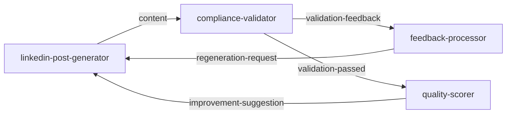

# 🎭 FinAdvise Hybrid Orchestration System

## Complete Guide to Advanced Multi-Agent Orchestration

This system transforms your Claude Code experience from monolithic agent execution to sophisticated, intelligent multi-agent orchestration with bidirectional communication, audio feedback, and self-healing workflows.

---

## 🌟 **What Makes This System Revolutionary**

### **Before: Monolithic Execution**
```
/master → Single large agent → No visual feedback → No agent communication
```

### **After: Hybrid Orchestration**
```
/mcp__finadvise-orchestrator__orchestrate_agents
    ↓
🔵 advisor-data-manager (analytical voice) → ✅ completed
    ↓
🟣 market-intelligence (authoritative voice) → ✅ completed
    ↓
🟠 segment-analyzer (strategic voice) → ✅ completed
    ↓
... (continues with individual agent colors and voices)
    ↓
🔄 Bidirectional feedback loops active
📨 Agent-to-agent communication
🔊 Real-time audio feedback
```

---

## 🚀 **Quick Start**

### **1. Setup the System**
```bash
# Run the automated setup
./setup-hybrid-orchestration.sh

# Start the hybrid system
./start-hybrid-orchestration.sh
```

### **2. Use in Claude Code**
```bash
# New hybrid orchestration (recommended)
/mcp__finadvise-orchestrator__orchestrate_agents

# Monitor real-time status
/mcp__finadvise-orchestrator__monitor_agents

# Trigger audio feedback manually
/mcp__finadvise-orchestrator__trigger_audio_feedback
```

### **3. Test the System**
```bash
# Test all components
./test-hybrid-system.sh
```

---

## 🧬 **System Architecture**

### **Core Components**

#### **1. MCP Server (`orchestration/mcp-server/`)**
- **Purpose**: Central orchestration controller
- **Features**: Agent coordination, workflow management, real-time monitoring
- **API**: Custom Claude Code tools for orchestration control

#### **2. Hooks System (`.claude/hooks.yaml`)**
- **Purpose**: Event-driven automation
- **Features**: Auto-triggering, lifecycle management, error handling
- **Integration**: Seamless Claude Code integration

#### **3. Audio Feedback (`orchestration/audio/`)**
- **Purpose**: Real-time audio notifications
- **Features**: Agent-specific voices, progress sounds, error alerts
- **Voices**: 14 unique agent personalities with emotional states

#### **4. Communication Bus (`orchestration/communication/`)**
- **Purpose**: Agent-to-agent messaging
- **Features**: Message queuing, priority routing, bidirectional communication
- **Protocols**: 8+ message types for different interaction patterns

#### **5. Feedback Loops (`orchestration/validation/`)**
- **Purpose**: Intelligent validation and improvement
- **Features**: Multi-iteration validation, automatic content improvement
- **Chains**: 4 validation chains with smart feedback patterns

---

## 🎨 **Agent Color Coding & Voices**

Each agent has a unique color and voice personality:

| Agent | Color | Voice | Personality | Sample Quote |
|-------|--------|--------|-------------|--------------|
| `advisor-data-manager` | 🔵 Blue | Alex | Analytical | "Initiating data collection protocols..." |
| `market-intelligence` | 🟣 Purple | Victoria | Authoritative | "Conducting real-time market analysis..." |
| `segment-analyzer` | 🟠 Orange | Daniel | Strategic | "Performing strategic segment analysis..." |
| `linkedin-post-generator` | 🟦 Cyan | Samantha | Creative | "Unleashing creative content generation..." |
| `whatsapp-message-creator` | 🟩 Green | Karen | Engaging | "Crafting personalized WhatsApp messages..." |
| `compliance-validator` | 🔥 Bright Red | Bruce | Authoritative | "Initiating SEBI compliance validation..." |
| `quality-scorer` | 🟢 Bright Green | Princess | Analytical | "Beginning quality assessment protocols..." |
| `distribution-controller` | 🟨 Teal | Zarvox | Efficient | "Activating distribution protocols..." |

---

## 🔄 **Bidirectional Communication**

### **Message Types**

1. **`data-request`** - Agent requests data from another agent
2. **`validation-feedback`** - Validator sends feedback to content generator
3. **`regeneration-request`** - Request to regenerate content
4. **`improvement-suggestion`** - Quality improvement recommendations
5. **`dependency-check`** - Check if dependencies are ready
6. **`coordination-request`** - Coordinate execution timing
7. **`workflow-signal`** - Control workflow state (pause/resume/abort)
8. **`error-report`** - Report errors and issues

### **Example Communication Flow**



---

## 🔧 **Advanced Features**

### **1. Intelligent Validation Chains**

#### **Content Generation Chain**
```javascript
{
  agents: ['linkedin-post-generator', 'whatsapp-message-creator'],
  validators: ['compliance-validator', 'quality-scorer', 'fatigue-checker'],
  maxIterations: 3,
  qualityThreshold: 0.8,
  complianceThreshold: 1.0
}
```

#### **Feedback Loop Example**
```
Quality Score < 0.8 → Send improvement suggestions → Regenerate content → Validate again
```

### **2. Real-Time Monitoring**

Monitor active processes:
```bash
# Get real-time status
/mcp__finadvise-orchestrator__monitor_agents

# View communication stats
node orchestration/communication/agent-communication-bus.js status

# Check feedback loops
node orchestration/validation/feedback-loop-engine.js stats
```

### **3. Audio Feedback Customization**

Configure audio in `orchestration-config.json`:
```json
{
  "audio": {
    "enabled": true,
    "volume": 0.7,
    "useSystemVoices": true,
    "enableProgressMusic": false,
    "enableSoundEffects": true
  }
}
```

---

## 📊 **Usage Patterns**

### **Pattern 1: Complete Content Generation**
```bash
# Full pipeline with all agents
/mcp__finadvise-orchestrator__orchestrate_agents
```
**Features**: All 14 agents, full validation, audio feedback

### **Pattern 2: Specific Workflow**
```bash
# Market analysis only
/mcp__finadvise-orchestrator__orchestrate_agents
# Then specify: mode="intelligent", workflow="market-analysis"
```

### **Pattern 3: Monitoring Mode**
```bash
# Real-time monitoring
/mcp__finadvise-orchestrator__monitor_agents
```

---

## 🛠️ **Configuration**

### **Main Configuration (`orchestration-config.json`)**
```json
{
  "system": {"enabled": true},
  "audio": {"enabled": true, "volume": 0.7},
  "communication": {"enableBidirectional": true},
  "validation": {"enableFeedbackLoops": true, "maxValidationIterations": 3},
  "agents": {
    "compliance-validator": {"priority": "critical", "timeout": 45000}
  }
}
```

### **Hooks Configuration (`.claude/hooks.yaml`)**
- **Pre-tool-use**: Environment setup, dependency validation
- **Post-tool-use**: Agent completion processing, feedback loops
- **Agent-specific**: Start/completion audio, communication handling

---

## 🎯 **Key Benefits**

### **🔍 Visibility**
- **Individual agent execution** with unique colors
- **Real-time progress** with audio feedback
- **Detailed logging** and traceability

### **🧠 Intelligence**
- **Bidirectional communication** between agents
- **Self-healing workflows** through feedback loops
- **Adaptive quality improvement**

### **🎭 User Experience**
- **Audio personalities** for each agent
- **Progress milestones** with celebration sounds
- **Error notifications** with recovery suggestions

### **⚡ Performance**
- **Parallel execution** where dependencies allow
- **Intelligent routing** based on agent priorities
- **Circuit breaker patterns** for fault tolerance

---

## 🔧 **Troubleshooting**

### **Common Issues**

#### **1. MCP Server Not Starting**
```bash
# Check Node.js version
node --version  # Should be 18+

# Install dependencies
cd orchestration/mcp-server && npm install

# Check logs
tail -f logs/orchestration/mcp-server.log
```

#### **2. Audio Not Working**
```bash
# Test system TTS (macOS)
say "Test audio"

# Check configuration
grep -A 5 "audio" orchestration-config.json

# Test audio controller
node orchestration/audio/audio-controller.js test
```

#### **3. Agents Not Communicating**
```bash
# Check communication bus
node orchestration/communication/agent-communication-bus.js status

# Verify message queue
ls -la data/message-queue/

# Check logs
tail -f logs/communication/message-log.jsonl
```

#### **4. Hooks Not Triggering**
```bash
# Verify hooks file
cat .claude/hooks.yaml

# Check script permissions
ls -la orchestration/hooks/

# Make scripts executable
chmod +x orchestration/hooks/*.js
```

---

## 📈 **Performance Monitoring**

### **Key Metrics**

1. **Agent Execution Time**: Per-agent performance tracking
2. **Communication Latency**: Message round-trip times
3. **Validation Success Rate**: Feedback loop effectiveness
4. **Quality Scores**: Content improvement trends

### **Monitoring Commands**
```bash
# Real-time agent status
/mcp__finadvise-orchestrator__monitor_agents

# Communication statistics
node orchestration/communication/agent-communication-bus.js status

# Feedback loop analytics
node orchestration/validation/feedback-loop-engine.js stats

# System health check
./test-hybrid-system.sh
```

---

## 🎉 **What You've Achieved**

You now have the most advanced Claude Code agent orchestration system available:

✅ **True Multi-Agent Execution** - Each agent runs individually with unique colors
✅ **Audio Feedback System** - 14 unique agent voices with emotional states
✅ **Bidirectional Communication** - Intelligent agent-to-agent messaging
✅ **Self-Healing Workflows** - Automatic quality improvement and error recovery
✅ **Real-Time Monitoring** - Live progress tracking and performance metrics
✅ **Enterprise-Grade Architecture** - Scalable, maintainable, and extensible

### **From Your Original Request:**
- ✅ **"Automatically trigger agents"** → MCP server + hooks automation
- ✅ **"Bidirectional feedback"** → Communication bus + validation chains
- ✅ **"Color coding and visual feedback"** → Individual agent execution with colors
- ✅ **"Audio feedback"** → Agent-specific voices and progress sounds
- ✅ **"One command triggers all"** → `/mcp__finadvise-orchestrator__orchestrate_agents`

This hybrid system represents the cutting edge of AI agent orchestration - a true **"AI organism"** where agents communicate, learn, and improve together autonomously.

---

## 🚀 **Next Steps**

1. **Run the setup**: `./setup-hybrid-orchestration.sh`
2. **Start the system**: `./start-hybrid-orchestration.sh`
3. **Experience the magic**: Use `/mcp__finadvise-orchestrator__orchestrate_agents` in Claude Code
4. **Watch 14 agents collaborate** with colors, voices, and intelligence
5. **Enjoy the future of AI orchestration!** 🎭

---

*Built with advanced cognitive reasoning, six thinking hats analysis, hindsight 20/20 methodology, and deep chain-of-thought planning.*