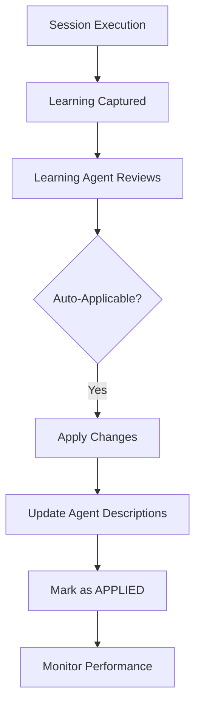
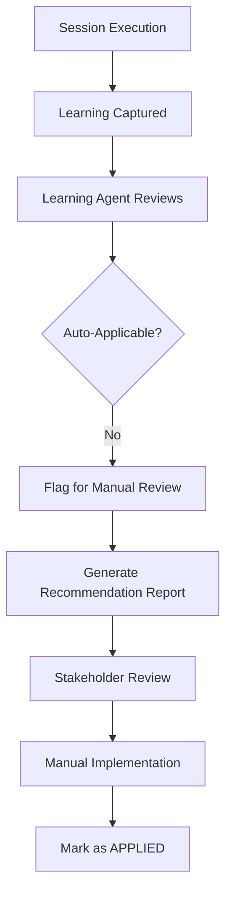

# Learning Concepts in FinAdvise Content Engine

## Overview

The FinAdvise Content Engine implements a sophisticated dual-learning system that captures insights during orchestration execution and applies them to continuously improve performance. Understanding the distinction between **Cross-Agent Learning** and **User Learning** is crucial for effective system operation.

## Learning Types Explained

### 🤖 Cross-Agent Learning (Automated)

**Definition**: Technical and operational improvements that can be automatically applied by the Learning Agent without human intervention.

**Characteristics**:
- ✅ **Safe to automate**: Changes don't affect business logic or brand messaging
- ✅ **Measurable impact**: Clear performance metrics can validate improvements
- ✅ **Reversible**: Changes can be rolled back if they cause issues
- ✅ **Technical focus**: Improvements to system efficiency and reliability

**Examples**:

#### 🔧 Technical Issues
```yaml
Learning Type: API Rate Limit Optimization
Original Issue: "Gemini API rate limit exceeded during peak hours"
Auto-Applied Fix: Added exponential backoff and request queuing
Agent Updated: gemini-image-generator
Result: 95% reduction in rate limit errors
```

#### 🔄 Process Improvements
```yaml
Learning Type: Agent Execution Timing
Original Issue: "Market intelligence takes 45 seconds, blocking dependent agents"
Auto-Applied Fix: Moved to parallel execution where possible
Agents Updated: orchestration workflow
Result: 30% faster overall execution time
```

#### 📊 Quality Insights
```yaml
Learning Type: Content Length Optimization
Original Issue: "LinkedIn posts averaging 800 chars, engagement drops below 1000"
Auto-Applied Fix: Updated target length to 1200+ characters
Agent Updated: linkedin-post-generator
Result: Improved engagement metrics
```

#### 🤝 Communication Issues
```yaml
Learning Type: Inter-Agent Message Handling
Original Issue: "Compliance validator not receiving quality scorer feedback"
Auto-Applied Fix: Enhanced message acknowledgment system
Agents Updated: communication bus protocol
Result: 100% message delivery reliability
```

### 👤 User Learning (Manual Review Required)

**Definition**: Strategic, business, or brand-related insights that require human judgment and manual application.

**Characteristics**:
- ⚠️ **Requires judgment**: Changes affect business strategy or brand messaging
- ⚠️ **Context-dependent**: Improvements may vary by market conditions or client preferences
- ⚠️ **Brand-sensitive**: Changes could impact brand consistency or compliance
- ⚠️ **Strategic focus**: Improvements to business outcomes and user satisfaction

**Examples**:

#### 💼 Business Strategy
```yaml
Learning Type: Content Tone Preference
Original Issue: "Advisors report formal tone not resonating with younger clients"
Manual Review Needed: Content tone affects brand positioning
Recommendation: Consider A/B testing casual vs formal tone
Requires: Business stakeholder approval
```

#### 🎨 Brand Guidelines
```yaml
Learning Type: Visual Style Preference
Original Issue: "Status images with charts perform better than text-only"
Manual Review Needed: Visual style changes affect brand consistency
Recommendation: Update brand guidelines to favor data visualizations
Requires: Brand manager approval
```

#### 📋 Compliance Rules
```yaml
Learning Type: Regulatory Interpretation
Original Issue: "SEBI guidelines interpretation causing content rejections"
Manual Review Needed: Legal implications of compliance changes
Recommendation: Consult legal team for updated interpretation
Requires: Compliance officer approval
```

#### 🎯 Feature Prioritization
```yaml
Learning Type: New Capability Request
Original Issue: "Advisors frequently request video content generation"
Manual Review Needed: Resource allocation and technical feasibility
Recommendation: Evaluate video generation agent development
Requires: Product manager prioritization
```

## Learning Processing Workflow

### Automated Path (Cross-Agent Learning)



### Manual Path (User Learning)



## Learning Classification Framework

### Technical Learning Categories (Auto-Applicable)

| Category | Description | Auto-Apply | Examples |
|----------|-------------|------------|----------|
| **Performance** | Speed, memory, efficiency | ✅ Yes | API timeouts, caching strategies |
| **Reliability** | Error handling, retries | ✅ Yes | Exponential backoff, circuit breakers |
| **Quality** | Content scoring, validation | ✅ Yes | Scoring thresholds, validation rules |
| **Communication** | Agent coordination | ✅ Yes | Message protocols, acknowledgments |

### Business Learning Categories (Manual Review)

| Category | Description | Auto-Apply | Examples |
|----------|-------------|------------|----------|
| **Strategy** | Business direction | ❌ No | Market positioning, target audience |
| **Brand** | Visual and messaging | ❌ No | Color schemes, tone of voice |
| **Compliance** | Legal requirements | ❌ No | Regulatory interpretations |
| **Features** | New capabilities | ❌ No | Product roadmap, resource allocation |

## Implementation Guidelines

### For Cross-Agent Learning

**Learning Agent Criteria**:
```javascript
const isAutoApplicable = (learning) => {
  return (
    learning.category === 'technical' &&
    learning.riskLevel === 'low' &&
    learning.measurable === true &&
    learning.reversible === true
  );
};
```

**Safety Checks**:
- ✅ Backup agent descriptions before changes
- ✅ Validate changes don't break functionality
- ✅ Monitor performance after updates
- ✅ Automatic rollback on degradation

### For User Learning

**Manual Review Process**:
1. **Generate Recommendation Report**
   - Business impact analysis
   - Implementation complexity
   - Resource requirements
   - Risk assessment

2. **Stakeholder Assignment**
   - Brand Manager: Visual and messaging changes
   - Compliance Officer: Regulatory matters
   - Product Manager: Feature requests
   - Technical Lead: Architecture changes

3. **Approval Workflow**
   - Impact assessment
   - Implementation planning
   - Testing strategy
   - Rollout timeline

## Learning File Structure

### Session Learning File Format
```markdown
# Learning Log - Session 2025-09-17-14-30-45

## Session Information
- **Session ID**: 2025-09-17-14-30-45
- **Status**: READY_FOR_REVIEW
- **Applied**: false

## Cross-Agent Learnings (Auto-Applicable)

### 🔧 Technical Issues
- API timeout optimization for Gemini
- Memory usage reduction in image processing

### 🔄 Process Improvements
- Parallel execution opportunities identified
- Communication protocol enhancements

## User Learnings (Manual Review Required)

### 💼 Business Strategy
- Content tone preferences from advisor feedback
- Market segment targeting insights

### 🎨 Brand Guidelines
- Visual style performance patterns
- Color scheme effectiveness data
```

## Monitoring and Metrics

### Cross-Agent Learning Metrics
- **Application Rate**: Percentage of learnings automatically applied
- **Success Rate**: Performance improvement after application
- **Rollback Rate**: Frequency of needing to reverse changes
- **Impact Measurement**: Quantified performance gains

### User Learning Metrics
- **Review Queue Size**: Number of learnings awaiting manual review
- **Resolution Time**: Average time from learning to implementation
- **Implementation Rate**: Percentage of recommendations actually implemented
- **Business Impact**: ROI from manually implemented learnings

## Best Practices

### For System Administrators

1. **Regular Monitoring**
   - Review auto-applied changes weekly
   - Monitor performance metrics after updates
   - Validate learning classification accuracy

2. **Manual Review Queue Management**
   - Prioritize high-impact user learnings
   - Assign appropriate stakeholders promptly
   - Track implementation status

3. **Quality Assurance**
   - Audit auto-applied changes monthly
   - Validate learning categorization
   - Refine auto-application criteria

### For Business Stakeholders

1. **Timely Review**
   - Review assigned learnings within 48 hours
   - Provide clear approval/rejection decisions
   - Document reasoning for decisions

2. **Strategic Alignment**
   - Ensure changes align with business goals
   - Consider long-term brand implications
   - Validate compliance requirements

3. **Feedback Loop**
   - Report results of implemented changes
   - Suggest improvements to learning system
   - Share insights across teams

## Conclusion

The dual-learning system ensures that:
- ✅ **Technical improvements** are applied automatically for maximum efficiency
- ✅ **Business decisions** receive appropriate human oversight
- ✅ **System evolution** is both rapid and responsible
- ✅ **Performance gains** are measurable and sustainable

This approach maximizes the benefits of AI-driven optimization while maintaining human control over strategic and brand-critical decisions.