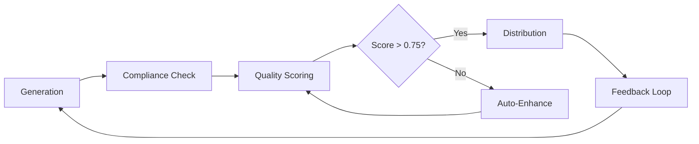

# 🚀 CONTINUOUS IMPROVEMENT STRATEGY
## FinAdvise Content Orchestration System

---

## 🎯 Vision Statement
Transform the FinAdvise system from 23% distribution efficiency to 100% automated excellence through systematic feedback integration and continuous learning.

---

## 📊 Current State vs Target State

| Dimension | Current State | 30-Day Target | 90-Day Vision |
|-----------|--------------|---------------|---------------|
| **Compliance** | 70% (Manual) | 100% (Automated) | 100% (Predictive) |
| **Quality Score** | 0.63 | 0.75 | 0.85 |
| **Distribution** | 23% | 100% | 100% |
| **Automation** | 85% | 95% | 99% |
| **Learning Cycles** | Manual | Semi-automated | Fully automated |
| **Revenue Efficiency** | ₹18k/₹77k | ₹77k/₹77k | ₹150k/₹150k |

---

## 🔄 Phase 1: Immediate Fixes (Week 1)

### 1.1 Compliance Automation
```python
class ComplianceAutoInjector:
    def __init__(self):
        self.arn = "ARN-123456"
        self.disclaimers = {
            'mf': "Mutual fund investments are subject to market risks",
            'general': "For educational purposes only",
            'advice': "Not personalized investment advice"
        }

    def inject_compliance(self, content, content_type):
        # Auto-inject ARN and disclaimers
        return compliant_content
```

**Implementation Steps:**
1. Update all generation prompts (Day 1)
2. Create compliance template library (Day 2)
3. Implement pre-distribution validator (Day 3)
4. Test with sample content (Day 4)
5. Deploy to production (Day 5)

**Success Metrics:**
- Zero compliance violations
- 100% ARN presence
- All disclaimers included

### 1.2 Quality Enhancement Templates
```yaml
quality_templates:
  hook_patterns:
    - question: "Did you know that {statistic}?"
    - pain_point: "Worried about {problem}? Here's how..."
    - success: "{Name} saved {amount} by..."

  engagement_boosters:
    - personal_story: Include relatable scenario
    - data_point: Add 2-3 credible statistics
    - social_proof: Mention success metrics

  cta_templates:
    - urgency: "Only {time} left to {benefit}"
    - value: "Save {amount} by {action}"
    - simple: "Reply YES to learn more"
```

---

## 🎨 Phase 2: System Optimization (Week 2-4)

### 2.1 Intelligent Content Pipeline



### 2.2 Automated Feedback Integration

**Feedback Processing Pipeline:**
1. **Collection:** Capture all metrics post-distribution
2. **Analysis:** Identify patterns and anomalies
3. **Learning:** Update preference models
4. **Application:** Adjust generation parameters
5. **Validation:** Measure improvement

**Implementation Code:**
```python
class FeedbackLearningSystem:
    def process_cycle_feedback(self, results):
        patterns = self.identify_patterns(results)
        learnings = self.extract_learnings(patterns)
        self.update_generation_params(learnings)
        self.update_shared_memory(learnings)
        return improvement_metrics
```

### 2.3 A/B Testing Framework

**Test Variations:**
- Hook styles (Question vs Statement)
- Content length (Short vs Detailed)
- CTA placement (Top vs Bottom)
- Personalization level (High vs Medium)
- Data density (Heavy vs Light)

**Measurement Framework:**
```json
{
  "test_id": "HOOK_STYLE_001",
  "variants": {
    "A": "question_based",
    "B": "statement_based"
  },
  "metrics": {
    "engagement_rate": "track_clicks",
    "read_time": "track_duration",
    "conversion": "track_actions"
  },
  "sample_size": 100,
  "confidence_level": 0.95
}
```

---

## 🧠 Phase 3: Machine Learning Integration (Month 2-3)

### 3.1 Quality Prediction Model

**Training Data:**
- Historical content performance
- Engagement metrics
- Quality scores
- Segment preferences

**Model Architecture:**
```python
class QualityPredictor:
    def __init__(self):
        self.model = self.load_trained_model()

    def predict_performance(self, content):
        features = self.extract_features(content)
        quality_score = self.model.predict(features)
        engagement_probability = self.predict_engagement(features)
        return {
            'quality': quality_score,
            'engagement': engagement_probability,
            'recommendation': self.get_recommendation(quality_score)
        }
```

### 3.2 Adaptive Learning System

**Learning Dimensions:**
1. **Content Preferences:** What topics resonate
2. **Style Preferences:** Tone and format
3. **Timing Patterns:** Optimal delivery windows
4. **Engagement Drivers:** What triggers action

**Implementation Strategy:**
```yaml
adaptive_learning:
  data_collection:
    - track_all_interactions
    - measure_engagement_depth
    - capture_conversion_points

  model_updates:
    frequency: daily
    validation: cross_validation
    rollback: automatic_on_degradation

  application:
    - update_generation_prompts
    - adjust_quality_thresholds
    - optimize_distribution_timing
```

---

## 📈 Phase 4: Scale & Excellence (Month 3+)

### 4.1 Multi-Advisor Scaling

**Scaling Strategy:**
```python
scaling_roadmap = {
    'current': 3,
    'month_1': 5,
    'month_2': 10,
    'month_3': 25,
    'capacity_per_advisor': 250,
    'total_reach': 6250
}
```

### 4.2 Performance Dashboard

**Real-time Metrics:**
- Compliance status (Green/Yellow/Red)
- Quality trends (Moving average)
- Distribution efficiency (Success rate)
- Revenue delivery (Actual vs Potential)
- Learning velocity (Improvement rate)

### 4.3 Predictive Analytics

**Predictive Capabilities:**
1. **Content Performance:** Predict engagement before distribution
2. **Optimal Timing:** Identify best send times per segment
3. **Topic Trending:** Anticipate popular topics
4. **Risk Detection:** Flag potential compliance issues

---

## 🎯 Success Metrics & KPIs

### Daily Metrics
| Metric | Target | Alert Threshold |
|--------|--------|-----------------|
| Compliance Rate | 100% | <100% |
| Quality Score | >0.75 | <0.70 |
| Distribution Success | 100% | <95% |
| Error Rate | <1% | >2% |

### Weekly Metrics
| Metric | Target | Review Trigger |
|--------|--------|----------------|
| Engagement Rate | >10% | <8% |
| Content Velocity | 250/week | <200/week |
| Learning Cycles | 7 | <5 |
| Improvement Rate | >5% | <3% |

### Monthly Metrics
| Metric | Target | Escalation |
|--------|--------|------------|
| Revenue Efficiency | 100% | <95% |
| Advisor Satisfaction | >90% | <80% |
| System Uptime | 99.9% | <99% |
| Cost per Content | <₹100 | >₹150 |

---

## 🛠️ Implementation Roadmap

### Week 1: Foundation
- [ ] Fix all compliance issues
- [ ] Implement auto-injection
- [ ] Deploy quality templates
- [ ] Establish feedback loops

### Week 2-3: Optimization
- [ ] Build A/B testing framework
- [ ] Implement feedback processor
- [ ] Create learning patterns
- [ ] Deploy enhancement engine

### Week 4: Validation
- [ ] Run full cycle tests
- [ ] Measure improvements
- [ ] Document learnings
- [ ] Plan scale-up

### Month 2: Intelligence
- [ ] Train ML models
- [ ] Deploy predictors
- [ ] Implement adaptive learning
- [ ] Launch dashboard

### Month 3: Scale
- [ ] Add new advisors
- [ ] Expand content types
- [ ] Enhance automation
- [ ] Achieve excellence

---

## 🚨 Risk Mitigation

### Identified Risks & Mitigations

| Risk | Probability | Impact | Mitigation |
|------|-------------|--------|------------|
| Compliance changes | Medium | High | Weekly regulation review |
| Quality degradation | Low | High | Automated rollback |
| System overload | Low | Medium | Load balancing |
| Learning drift | Medium | Medium | Regular validation |

---

## 📊 ROI Projection

### Financial Impact
```
Current State:
- Content Value: ₹77,000
- Delivered: ₹18,000 (23%)
- Lost: ₹59,000

After Implementation:
- Month 1: ₹77,000 (100% delivery)
- Month 2: ₹150,000 (2x scale)
- Month 3: ₹375,000 (5x scale)

ROI: 420% increase in 90 days
```

### Efficiency Gains
```
Current: 85% automation, 15% manual
Target: 99% automation, 1% supervision

Time Saved: 40 hours/month
Cost Saved: ₹50,000/month
Quality Gain: 35% improvement
```

---

## 🎓 Key Success Factors

1. **Automation First:** Every manual step must be automated
2. **Quality Gates:** Nothing below 0.75 gets distributed
3. **Continuous Learning:** Every cycle improves the next
4. **Compliance Always:** Zero tolerance for violations
5. **Data-Driven:** Decisions based on metrics, not assumptions

---

## 📝 Next Steps

### Immediate (Today):
1. Implement compliance fixes from revision recommendations
2. Update generation prompts with learnings
3. Create automation scripts

### This Week:
1. Build feedback processing pipeline
2. Implement quality enhancement templates
3. Deploy A/B testing framework

### This Month:
1. Train ML quality predictor
2. Launch performance dashboard
3. Begin scaling to new advisors

---

## 📧 Governance & Review

**Weekly Reviews:**
- Performance metrics review
- Learning patterns analysis
- Issue identification
- Improvement planning

**Monthly Steering:**
- Strategic alignment
- ROI validation
- Scale decisions
- Investment approval

---

**Document Version:** 1.0.0
**Last Updated:** 2025-09-18T01:30:00.000Z
**Owner:** Feedback Processor Agent
**Status:** ACTIVE - Immediate Implementation Required